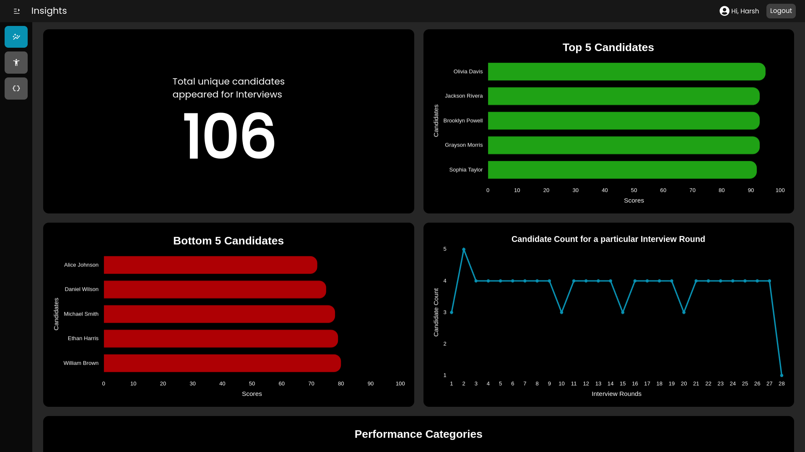
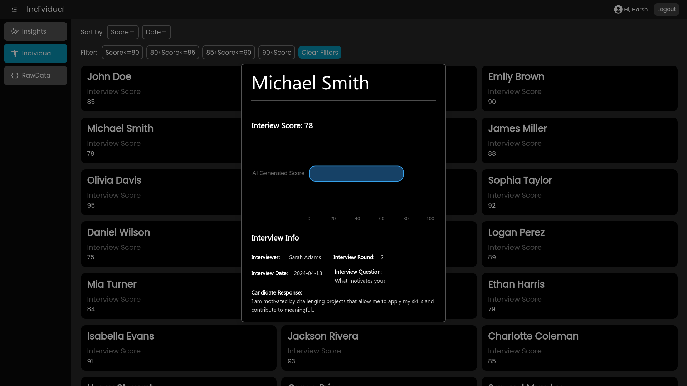
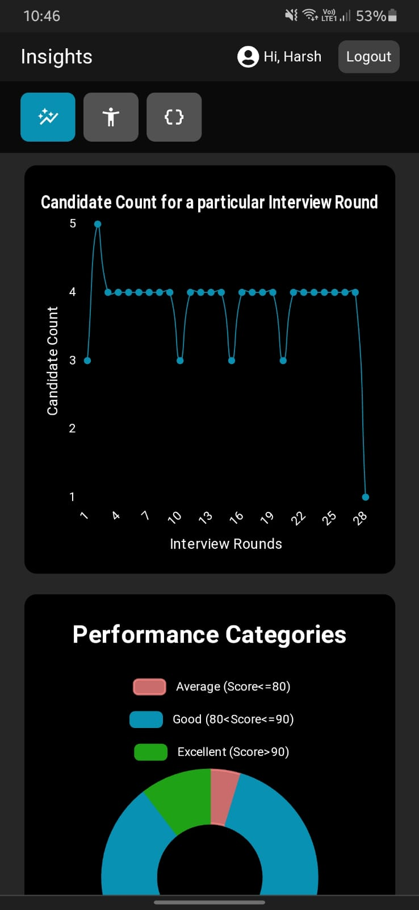
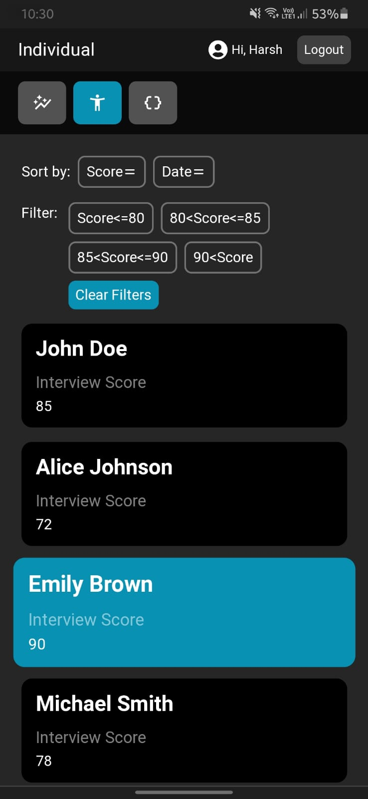
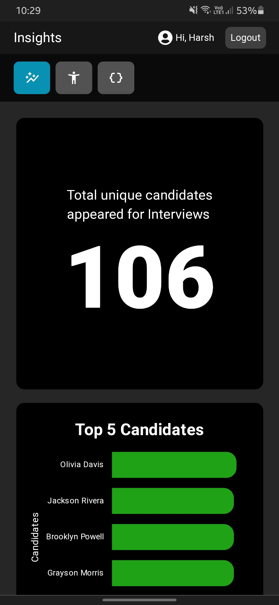

# Analytics Dashboard
### An interactive information Dashboard component made using React.js, Tailwind CSS, Ant Design and Chart.js

### To Run locally:
```
git clone 'https://github.com/harshpx/dashboard.git'
cd dashboard
npm install
npm run dev
```

### Also Deployed on Vercel (live link): [https://dashboard-harshpx.vercel.app/Login](https://dashboard-harshpx.vercel.app/Login)

## Features
* Clean and Responsive UI (looks awesome on all screen sizes) using Tailwind CSS
* Interactive Data Visualization using Chart.js
* Data Sort and Filter functionality
* Modular and Well-Structured code

## Screenshots
<div>
<h3 style=''>Big Screens</h3>


</div>

<div style='display:flex; flex-direction:column; gap:0.5em'>
    <h3 style=''>Small Screens</h3>
    <div style='display:flex; gap:0.5em'>
        
        
    </div>
    <div style='display:flex; gap:0.5em'>
        
        
    </div>
</div>

<br/>
<br/>
<br/>

### Made with &hearts; by Harsh Priye